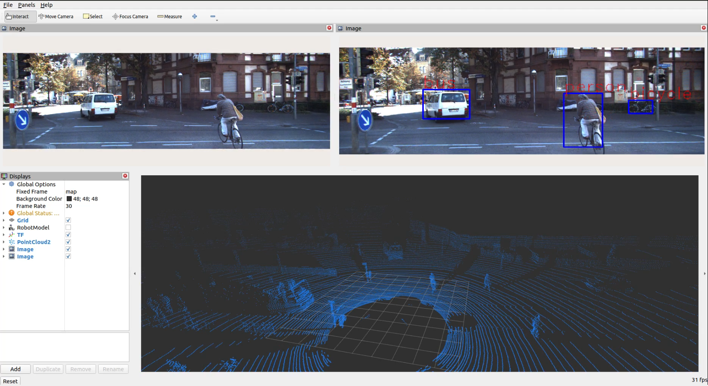
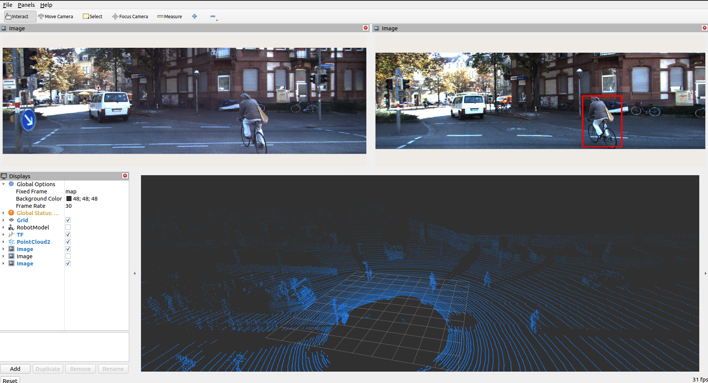

## Perception Pipeline

This repository implements a modular perception pipeline for autonomous driving, leveraging ROS2 and the Kitti dataset. The pipeline is designed with a late fusion strategy, where individual sensor modalities process data independently before their detections are combined.

## Camera Detector Node

This ROS2 node handles the 2D object detection from camera imagery.

* **Input:**: Subscribes to raw camera images (e.g., from a Kitti dataset publisher).

* **Processing:**

  * Utilizes a YOLOv3 (You Only Look Once) deep learning model to perform real-time object detection and classification within the 2D image plane.

  * Applies Non-Maximum Suppression (NMS) to refine the detected bounding boxes.

* **Output:** Publishes 2D bounding box detections (class, confidence, 2D box coordinates) for each identified object.

Key Libraries: rclcpp, cv_bridge, OpenCV (DNN module)

## Perception Pipeline

This ROS2 node transforms object coordinates from lidar sensor to camera coordinates.handles the 2D object detection from camera imagery.

* **Input:**: Subscribes to raw camera images and velodyne lidar inputs (e.g., from a Kitti dataset publisher).

* **Processing:**

  * It transforms the points to the camera coordinates and draws them on the image.

* **Output:** Publishes processed image for each identified object.

Key Libraries: rclcpp, cv_bridge, open3d, OpenCV

